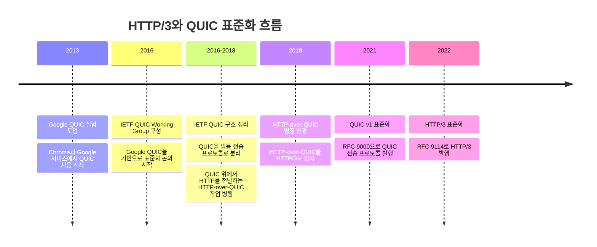

# HTTP/3와 QUIC

## 개요

HTTP/3는 HTTP의 의미론은 유지하면서, 전송 계층을 TCP가 아닌 QUIC 위로 옮긴
HTTP의 세 번째 주요 버전이다.
즉 메서드, 상태 코드, 헤더와 같은 HTTP 모델은 변경하지 않고,
연결 방식의 기반을 QUIC으로 바꾼 프로토콜이다.

이 문서는 HTTP/3의 개념과 등장 배경, 동작 방식, 기반 기술인 QUIC을 정리하고,
기존 HTTP/2와의 차이와 주요 언어 및 구현체들의 지원 형태를 함께 살펴보기 위한 문서이다.

구체적인 HTTP/3 명세는 [RFC 9114](https://datatracker.ietf.org/doc/html/rfc9114)를 참고할 수 있고,
후술할 QUIC 전송 프로토콜은 [RFC 9000](https://datatracker.ietf.org/doc/html/rfc9000)을 참고할 수 있다.

## 등장 배경

### TCP의 한계

HTTP/3가 등장한 직접적인 이유는 HTTP/2가 TCP 위에서 동작한다는 점에 있다.
HTTP/2의 멀티플렉싱은 한 TCP 연결 위에서 여러 요청과 응답을 동시에 처리할 수 있게 했지만,
여전히 다음과 같은 문제가 남아 있었다.

- HOL(Head-of-Line) Blocking: 패킷 손실 시 같은 TCP 연결의 다른 스트림까지 영향
- 연결 지연: TCP 연결 수립과 TLS 협상 과정에서 왕복 지연 발생
- 연결 유지: 모바일 환경에서 네트워크 변경 시 재연결 필요

그리고 이 문제를 줄이기 위한 출발점이 Google이 2013년 Chrome과 자사 서비스에
실험적으로 도입한 QUIC이다.

### QUIC의 등장

QUIC(Quick UDP Internet Connections)은 UDP 위에서 동작하면서도 신뢰성 있는 전송,
스트림 멀티플렉싱, 암호화, 빠른 연결 수립을 함께 제공하려는 시도였다.
Google QUIC은 이후 IETF 표준화 과정에서 범용 전송 프로토콜로 재정리되었고,
그 위에서 HTTP를 전달하는 HTTP-over-QUIC 작업이 함께 진행되었다.
이 HTTP-over-QUIC 작업은 2018년 IETF 논의 과정에서 HTTP/3라는 이름으로 정리되었다.

#### 생태계의 반응

HTTP/3 지원은 브라우저와 대형 서비스, CDN에서 먼저 확산되었다.
Google은 Chrome과 자사 서비스를 통해 QUIC을 먼저 실험했고,
Cloudflare 같은 CDN은 2019년부터 Chrome, Firefox와 함께 HTTP/3 지원을 공개적으로 확산시켰다.

이후 서버, 프록시, 네트워크 라이브러리 구현체들이 IETF QUIC과 HTTP/3를 지원하기 시작했다.
반면 언어 런타임과 표준 API의 지원은 더 늦게 따라왔다. Java는 JDK 26에서
`java.net.http.HttpClient`의 HTTP/3 지원을 정식 릴리스했다.
Python과 Kotlin은 언어 표준 라이브러리 차원의 HTTP/3 지원보다는 실행 환경과
서드파티 라이브러리의 지원 여부에 따라 사용 방식이 결정된다.
Python은 `aioquic` 같은 구현체를 통해 QUIC과 HTTP/3를 사용할 수 있고,
Kotlin 계열은 JVM, Ktor, Netty, OkHttp 같은 실행 환경과 라이브러리의 영향을 받는다.

## QUIC 개념과 특징

## HTTP/3 동작 원리

## HTTP/2와의 차이

## 언어 및 구현체 지원 현황

## 관련 기술

## 정리
